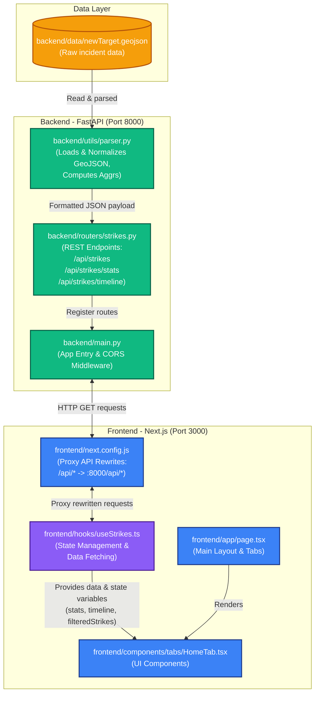

# MahsaAlert Intelligence Dashboard Architecture

This document illustrates how data flows between the backend and frontend in the MahsaAlert Dashboard application.

## High-Level Architecture

The Dashboard is built using a decoupled client-server model:
1. **Backend (FastAPI)**: Serves a RESTful API, parses static geo-data (GeoJSON), and handles data filtering and aggregations.
2. **Frontend (Next.js)**: A React application running on Next.js, serving the UI and handling client-side state, making proxy requests to the backend.

### Full System Data Flow Diagram

## Description of Architecture Flow

1. **Storage Layer**: 
   The data completely resides inside `backend/data/newTarget.geojson`. It stores a feature collection of all reported incidents and strikes in JSON format.

2. **Data Parsing & Backend Processing**:
   The `backend/utils/parser.py` loads the static GeoJSON file. It converts and maps its structure into easy-to-consume Python dictionaries, normalizes the dates, handles string booleans, and formats tweets parameters.
   It also handles logic for aggregating the stats representing dashboard summaries.

3. **Routing Configuration**:
   The logic created in the parser is bound to RESTFUL endpoints in `backend/routers/strikes.py` exposing:
   * `/api/strikes`
   * `/api/strikes/stats`
   * `/api/strikes/timeline`
   
   These controllers run from the FastAPI root instance configured in `backend/main.py`.

4. **Next.js Proxy Rewrite**:
   In `frontend/next.config.js`, API rewrites are configured under `rewrites()` so that Next.js automatically directs any client network calls prefixing `/api/:path*` through to `http://localhost:8000/api/:path*`. This natively handles most CORS and structural proxy needs.

5. **Client Fetching Hook**:
   Running inside Next.js, `hooks/useStrikes.ts` creates the central bridge on the client. It sends GET requests to `/api/strikes/*`, stores them in React states, tracks `isLoading` attributes, and yields structured variables back to standard functional React components.

6. **React UI Rendering**:
   Elements like `HomeTab.tsx` invoke `useStrikes()` implicitly pulling all backend variables. The Dashboard component (`app/page.tsx`) organizes and switches multiple tabs ensuring exactly what part of the application is updated and visible.
